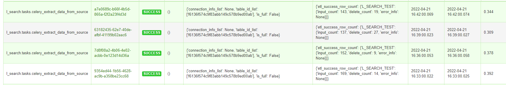

# Leader-Search

[中文版](readme_zh_cn.md)

leader-search is a lightweight tool that solves isolated data island; it is a distributed ETL platform which contain schedule and data store, provides SQL queries for stored data.


leader-search features：

1. **Metadata manager**: automatically get target database metadata information;
2. **Automatically extract**: depend on the metadata for the data extraction;
3. **Temporal data**: after the data extracted, the data of all time points will be retained;
4. **SQL query**: Query store data with SQL


Support database source：

- Postgresql
- Mysql
- Sql server


## How to Build

```
docker-compose build --force-rm
```


## Getting Started

Start container

```
docker-compose --compatibility up -d
```


Browse address

​	Swagger url: 127.0.0.1:6680

​	Task monitor url: 127.0.0.1:6681


Property info:

modify in docker-compose.yml

| Key                        | Example       | Remarks                                      |
| -------------------------- | ------------- | -------------------------------------------- |
| EXTRACT_CHUNK_SIZE         | 50000         | The amount of data extracted in single cycle |
| LSEARCH_TIMEZONE           | Asia/Shanghai | Time zone                                    |
| GEO_CRS_CODE               | 4326          | geo crs code                                 |
| LSEARCH_SYNC_META_SCHEDULE | 21 * * * *    | Synchronization metadata crontab             |


## Usage

### 1. Input data source

**API**: [ POST ]   /meta/connection/upsert

**Request Body**

| Key          | Value                      | Remarks                                      |
| ------------ | -------------------------- | -------------------------------------------- |
| ✦ domain     | String                     | Annotate different business domains          |
| ✦ db_type    | [mysql, postgresql, mssql] | Only these three databases                   |
| ✦ host       | String                     | Database ip                                  |
| ✦ port       | Int                        | Database port                                |
| ✦ default_db | String                     | The database name that needs to be connected |
| db_schema    | String                     | For postgresql schema                        |
| ✦ account    | String                     | Database login user                          |
| ✦ pwd        | String                     | Database login password                      |


### 2. Synchronous Source db metadata

**API**: [ POST ]   /meta/sync

**Request Body**

| Key               | Value           | Remarks                           |
| ----------------- | --------------- | --------------------------------- |
| ✦ connection_id   | Int             | From input data source api return |
| table_name_list   | List < String > | Need extract table name           |
| table_name_prefix | String          | Need extract table name prefix    |


**Response** 

| Key     | Explain              | Remarks                                       |
| ------- | -------------------- | --------------------------------------------- |
| task_id | asynchronous task id | Api real data, need get through task info api |


Synchronization metadata in schedule,  Scheduling time is set in LSEARCH_SYNC_META_SCHEDULE.


### 3.Extract data

#### Manual

**API**: [ POST ]   /entity/extract_and_load

**Request Body**

| Key          | Value           | Remarks                                                      |
| ------------ | --------------- | ------------------------------------------------------------ |
| connections  | List < Int >    | From input data source api return                            |
| tables       | List < String > | Table info id（from get table info api return）              |
| extract_type | [ i , f ]       | Increment or full. (Ps: increment extract type need table has primary column and increment tag column (such like update_ts), otherwise program default use full. ) |


**Response** 

| Key     | Explain              | Remarks                                       |
| ------- | -------------------- | --------------------------------------------- |
| task_id | asynchronous task id | Api real data, need get through task info api |


#### automatic

Automatically extract table data, should be set schedule.


**API**: [ POST ]   /meta/table/info/upsert

**Request Body**

| Key         | Value  | Remarks                        |
| ----------- | ------ | ------------------------------ |
| id          | String | From get table info api return |
| crontab_str | String | Cron schedule expressions      |


table extract task monitor




### 4. Select data

Data after loop extracted, will create temporal data.


**API**: [ POST ]   /entity/extract_and_load

**Request Body**

| Key           | Value                        | Remarks                                                      |
| ------------- | ---------------------------- | ------------------------------------------------------------ |
| sql           | String                       | Select sql like usual. table name in sql used table name alias. (Ps: set in table info, default value equal table name, table name alias are set up to avoid heavy names) |
| connection_id | List < Int >                 | Table names are limited by connection information. (This action is to avoid heavy names) |
| period_time   | String (YYYY-MM-DD HH:MI:SS) | Set backtracking point in time                               |

**Response** 

| Key     | Explain              | Remarks                                       |
| ------- | -------------------- | --------------------------------------------- |
| task_id | asynchronous task id | Api real data, need get through task info api |


**Example:**

SQL: select k_name,v_value,start_time from l_search_test where id in (131)

Get current


Get history


### 5. Show metadata

#### Get table info

**API**: [ GET ]   /meta/< connection_id >/tables/info

**Parameters:**

| Key            | Value | Remarks                           |
| -------------- | ----- | --------------------------------- |
| ✦connection_id | Int   | From input data source api return |


**Response** 

| Key               | Explain              | Remarks                                                      |
| ----------------- | -------------------- | ------------------------------------------------------------ |
| table_name_alias  | table name alias     | Used as a table name in select data SQL                      |
| table_extract_col | increment tag        | For increment extract. Program will set which column like update_ts or updatetime as the increment tag. If set other name to increment tag, set EXTRACT_FILTER_COLUMN_NAME var in setting/__ init __.py |
| crontab_str       | table extact scedule | Cron schedule expressions                                    |


#### Get table metadata

**API**: [ GET ]   /meta/< table_id >/detail

**Parameters:**

| Key       | Value  | Remarks                        |
| --------- | ------ | ------------------------------ |
| ✦table_id | String | From get table info api return |


**Response**

| Key        | Explain       | Remarks                                                      |
| ---------- | ------------- | ------------------------------------------------------------ |
| is_primary | table primary | if table does not have primary column, extract type will be full. |


### 6. Get task info

**API**: [ GET ]   /task/< task_id>

**Parameters:**

| Key      | Value  | Remarks                          |
| -------- | ------ | -------------------------------- |
| ✦task_id | String | From all asynchronous api return |


