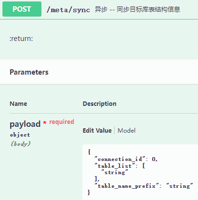
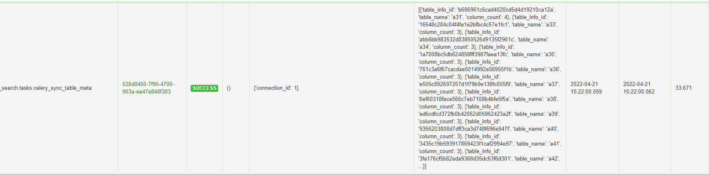
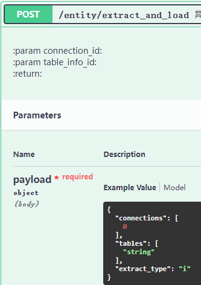
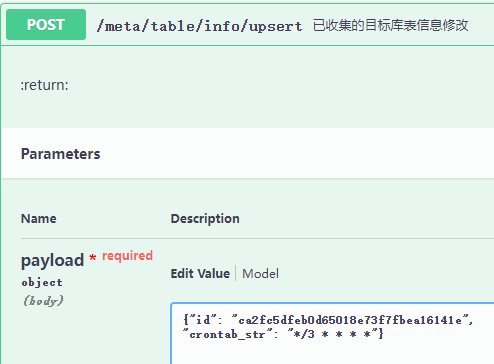
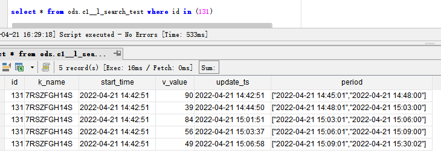
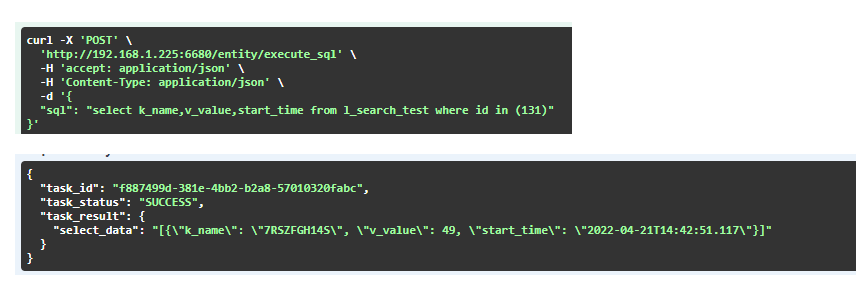
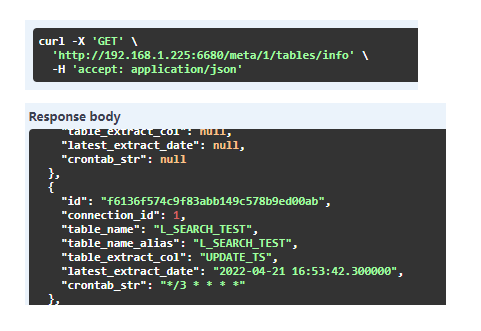
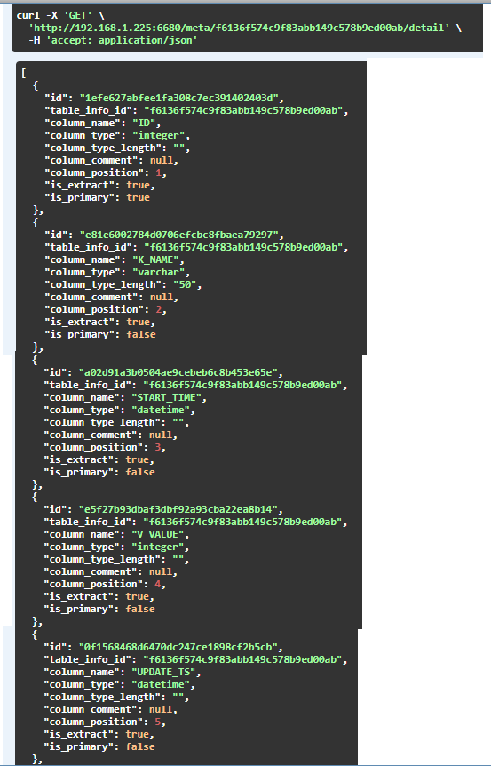

# Leader-Search


leader-search是一个解决数据孤岛的轻量化工具；是一个分布式数据自动抽取与存储平台，提供SQL查询已整合的数据。


主要功能：

1. **元数据管理**：自动获取业务系统后台数据库的元数据信息
2. **自动抽取**：依赖元数据对业务系统内的数据进行定时自动批抽取
3. **时态数据**：对抽取入库的数据，进行时间标注，保留任何时间点的状态的数据
4. **数据查询**：通过SQL查询不同时态下多系统的关联数据


支持的数据源：

- Postgresql
- Mysql
- Sql server


## 编译

```
docker-compose build --force-rm
```


## 开始

启动容器

```
docker-compose --compatibility up -d
```


浏览地址

​	Swagger url: 127.0.0.1:6680

​	Task monitor url: 127.0.0.1:6681


属性信息

在docker-compose.yml中修改如下信息

| 环境变量                   | 示例          | 解释                                |
| -------------------------- | ------------- | ----------------------------------- |
| EXTRACT_CHUNK_SIZE         | 50000         | 对源数据单词抽取的数据量            |
| LSEARCH_TIMEZONE           | Asia/Shanghai | 时区                                |
| GEO_CRS_CODE               | 4326          | geo crs code                        |
| LSEARCH_SYNC_META_SCHEDULE | 21 * * * *    | 元数据定时同步的时间周期（crontab） |


## 用法

### 1. 输入目标数据库连接信息

**API**: [ POST ]   /meta/connection/upsert

**Request Body**

| Key          | Value                      | 备注                          |
| ------------ | -------------------------- | ----------------------------- |
| ✦ domain     | String                     | 业务主体域,用于标识不同业务域 |
| ✦ db_type    | [mysql, postgresql, mssql] | 只支持这三种数据库            |
| ✦ host       | String                     | IP                            |
| ✦ port       | Int                        | 端口                          |
| ✦ default_db | String                     | 目标数据库                    |
| db_schema    | String                     | 针对pg                        |
| ✦ account    | String                     | 数据库登入账号                |
| ✦ pwd        | String                     | 数据库登入密码                |


### 2. 同步目标数据库表结构

**API**: [ POST ]   /meta/sync

**Request Body**

| Key               | Value           | 备注                               |
| ----------------- | --------------- | ---------------------------------- |
| ✦ connection_id   | Int             | 来自第一点目标数据库录入后返回的id |
| table_name_list   | List < String > | 需要抽取的表名（实际表名）         |
| table_name_prefix | String          | 需要抽取的表名的前缀               |




**Response** 

| 返回值  | 说明       | 备注                                                        |
| ------- | ---------- | ----------------------------------------------------------- |
| task_id | 异步任务id | 接口真实的返回内容，需通过获取任务信息接口用task_id进行查询 |


根据LSEARCH_SYNC_META_SCHEDULE设置的调度时间对目标数据库的元数据进行定时同步




### 3.抽取数据

#### 手动抽取

**API**: [ POST ]   /entity/extract_and_load

**Request Body**

| Key          | Value           | 备注                                                         |
| ------------ | --------------- | ------------------------------------------------------------ |
| connections  | List < Int >    | 来自第一点目标数据库录入后返回的id                           |
| tables       | List < String > | 需要抽取的表id（来自表信息返回的id）                         |
| extract_type | [ i , f ]       | 增量抽取，全量抽取（只有设置或是侦探到增量标志位的表才会进行增量抽取，若设置为增量单无增量标志位，则按全量抽取） |




**Response** 

| 返回值  | 说明       | 备注                                                        |
| ------- | ---------- | ----------------------------------------------------------- |
| task_id | 异步任务id | 接口真实的返回内容，需通过获取任务信息接口用task_id进行查询 |


#### 自动抽取

表数据定时抽取，需对表信息设置调度信息

**API**: [ POST ]   /meta/table/info/upsert

**Request Body**

| Key         | Value  | 备注                 |
| ----------- | ------ | -------------------- |
| id          | String | 来自表信息返回的表id |
| crontab_str | String | 需符合crontab写法    |



任务监控页面


### 4. 数据获取

已经抽取的数据，按时态存放如下




**API**: [ POST ]   /entity/extract_and_load

**Request Body**

| Key           | Value                        | 备注                                                         |
| ------------- | ---------------------------- | ------------------------------------------------------------ |
| sql           | String                       | select sql 写法和普通的一样，表名默认使用表别名，表别名默认与表名相同 |
| connection_id | List < Int >                 | 限制sql中的表来自目标库，解决表名重复的问题                  |
| period_time   | String (YYYY-MM-DD HH:MI:SS) | 设置数据所在的历史时间，根据时态记录返回历史某个时间段的数据 |

**Response** 

| 返回值  | 说明       | 备注                                                        |
| ------- | ---------- | ----------------------------------------------------------- |
| task_id | 异步任务id | 接口真实的返回内容，需通过获取任务信息接口用task_id进行查询 |


**案例：**

SQL: select k_name,v_value,start_time from l_search_test where id in (131)

获取最新的数据




获取历史某个时间下的数据


### 5. 查看同步过来的表结构

#### 查看表信息

**API**: [ GET ]   /meta/< connection_id >/tables/info

**Parameters:**

| Key            | Value | 备注                               |
| -------------- | ----- | ---------------------------------- |
| ✦connection_id | Int   | 来自第一点目标数据库录入后返回的id |



**Response** 

| 返回值            | 说明                                        | 备注                                                         |
| ----------------- | ------------------------------------------- | ------------------------------------------------------------ |
| table_name_alias  | 别名，作用于获取数据时候的sql，避免表命相同 |                                                              |
| table_extract_col | 增量标志，作用于抽取                        | 默认对（"update_ts", "updatetime"）这两个单词进行自动标注。若需要重新设置，需对setting下EXTRACT_FILTER_COLUMN_NAME进行修改 |
| crontab_str       | 表数据抽取调度设置                          |                                                              |


#### 查看表的列信息

**API**: [ GET ]   /meta/< table_id >/detail

**Parameters:**

| Key       | Value  | 备注                 |
| --------- | ------ | -------------------- |
| ✦table_id | String | 来自表信息清单里的id |



**Response**

| 返回值     | 说明 | 备注                               |
| ---------- | ---- | ---------------------------------- |
| is_primary | 主键 | 若表没有主键，则也无法进行增量抽取 |


### 6. 获取任务信息

**API**: [ GET ]   /task/< task_id>

**Parameters:**

| Key      | Value  | 备注                        |
| -------- | ------ | --------------------------- |
| ✦task_id | String | 来自异步api调用后的返回结果 |


